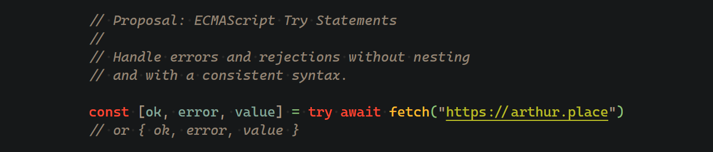

<h1>ECMAScript Try Expressions</h1>

> [!WARNING]  
> After extensive discussion and feedback, the proposal was renamed from `Safe Assignment Operator` to `Try Expressions`. _Click here to view the [original proposal](https://github.com/arthurfiorette/proposal-try-statements/tree/proposal-safe-assignment-operator)._


<!--
<div align="center">
  
</div>
-->

<br />

Whereas a try block protects an entire block, a try expression protects an entire expression.

This proposal aims to address the ergonomic challenges of managing multiple, often nested, `try/catch` blocks that are necessary for handling operations that may fail at various points.

Only the `catch (error) {}` block represents actual control flow, while no program state inherently depends on being inside a `try {}` block. Therefore, forcing the successful flow into nested blocks is not ideal.


**From this**

```js
let _result // use a temp variable
try {
  _result = TryResult.ok(await expr1) 
} catch (error) {
  _result = TryResult.error(error) 
}
const result = _result // enforce const
```

**To this**

```js
const result = try await expr1
```

<hr />

- [Try/Catch Is Not Enough](#trycatch-is-not-enough)
- [What This Proposal Does Not Aim to Solve](#what-this-proposal-does-not-aim-to-solve)
- [Try Expression](#try-expression)
  - [Same parsing rules as assignment expression (with one caveat)](#same-parsing-rules-as-assignment-expression-with-one-caveat)
  - [(Surround object literal with parentheses)](#surround-object-literal-with-parentheses)
  - [Statements are not expressions](#statements-are-not-expressions)
  - [Any valid expressions can be used](#any-valid-expressions-can-be-used)
  - [Highest precedence possible](#highest-precedence-possible)
  - [Never throws](#never-throws)
  - [Void Operations](#void-operations)
- [Syntax](#syntax)
  - [Runtime Semantics: Evaluation](#runtime-semantics-evaluation)
  - [TryExpressionResult abstract operation](#tryexpressionresult-abstract-operation)
  - [The underlying requirements](#the-underlying-requirements)
- [TryResult class](#tryresult-class)
  - [**Structure of a `TryResult` Instance**](#structure-of-a-tryresult-instance)
  - [**Iterable Behavior**](#iterable-behavior)
  - [**Manual Creation of a `TryResult`**](#manual-creation-of-a-tryresult)
  - [A fairly contrived example using Typescript](#a-fairly-contrived-example-using-typescript)
- [Why Not `data` First?](#why-not-data-first)
- [The Need for an `ok` Value](#the-need-for-an-ok-value)
- [Caller's Approach](#callers-approach)
- [Why a Proposal?](#why-a-proposal)
- [Help Us Improve This Proposal](#help-us-improve-this-proposal)
- [Authors](#authors)
- [Inspiration](#inspiration)
- [License](#license)
- [Extra Examples](#extra-examples)


<br />

## Try/Catch Is Not Enough

<!-- Credits to https://x.com/LeaVerou/status/1819381809773216099 :) -->

The `try {}` block is often redundant, as its scoping lacks meaningful conceptual significance. It generally acts more as a code annotation than a genuine control flow construct. Unlike true control flow blocks, no program state exists that requires being confined to a `try {}` block.

Conversely, the `catch {}` block **is** genuine control flow, making its scoping relevant and meaningful. According to Oxford Languages, an exception is defined as:

> a person or thing that is excluded from a general statement or does not follow a rule.

Since `catch` handles exceptions, it is logical to encapsulate exception-handling logic in a block to exclude it from the general program flow.

The pseudocode below illustrates the lack of value in nesting the success path within a code block:

```js
async function handle(request, reply) {
  try {
    const userInfo = await cache.getUserInfo(request.id)

    try {
      const posts = await db.getPosts(userInfo.authorId)

      let comments

      // Variables used after error handling must be declared outside the block
      try {
        comments = await db.getComments(posts.map((post) => post.id))
      } catch (error) {
        logger.error(error, "Posts without comments not implemented yet")
        return reply.status(500).send({ error: "Could not get comments" })
      }

      // Do something with comments before returning
      return reply.send({ userInfo, posts, comments })
    } catch (error) {
      logger.error(error, "Anonymous user behavior not implemented yet")
      return reply.status(500).send({ error: "Could not get posts" })
    }
  } catch (error) {
    logger.error(error, "Maybe DB is down?")
    return reply.status(500).send({ error: "Could not get user info" })
  }
}
```

With the proposed `try` statement, the same function can be rewritten as:

```js
async function handle(request, reply) {
  const userInfo = try await cache.getUserInfo(request.id)

  if (!userInfo.ok) {
    logger.error(userInfo.error, "Maybe DB is down?")
    return reply.status(500).send({ error: "Could not get user info" })
  }

  const posts = try await db.getPosts(userInfo.value.authorId)

  if (!posts.ok) {
    logger.error(posts.error, "Anonymous user behavior not implemented yet")
    return reply.status(500).send({ error: "Could not get posts" })
  }

  const comments = try await db.getComments(posts.value.map((post) => post.id))

  if (!comments.ok) {
    logger.error(comments.error, "Posts without comments not implemented yet")
    return reply.status(500).send({ error: "Could not get comments" })
  }

  // No need for reassignable variables or nested try/catch blocks

  // Do something with comments before returning
  return reply.send({ userInfo: userInfo.value, posts: posts.value, comments: comments.value })
}
```

A `try` expression provide significant flexibility and arguably result in more readable code. A `try` expression is an expression that can be used wherever an expression is expected, allowing for concise and readable error handling.

<br />

## What This Proposal Does Not Aim to Solve

1. **Strict Type Enforcement for Errors**: The `throw` statement in JavaScript can throw any type of value. This proposal does not impose type safety on error handling and will not introduce types into the language. For more information, see [microsoft/typescript#13219](https://github.com/Microsoft/TypeScript/issues/13219). _(This also means no generic error type for [Result](#result-class))_

2. **Automatic Error Handling**: While this proposal facilitates error handling, it does not automatically handle errors for you. You will still need to write the necessary code to manage errors the proposal simply aims to make this process easier and more consistent.

<br />

## Try Expression

The try keyword followed by a single expression.

Whereas a try block protects an entire block, a try expression protects an entire expression. 

The `try` expression is an Assignment Expression and consists of the `try` keyword followed by an Assignment Expression. Yes, it's recursive.

Like the `yield`, `await`, and `typeof` keywords, it has a result. Its result is an instance of the [`TryResult` class](#tryresult-class).

### Same parsing rules as assignment expression (with one caveat)

### (Surround object literal with parentheses)

When using `try` with an object literal, the literal must be enclosed in parenthesis:

```js
try { myProperty: "test" } // looks like a try statement missing a catch
try ({ myProperty: "test" }); // valid, like an arrow function
const result = try ({ data: await fetch("url", { headers: {} }) })
```

This behavior mirrors how JavaScript differentiates blocks and object literals:

<!-- prettier-ignore -->
```js
{ a: 1 } // empty block with a label
({ a: 1 }) // object with a key `a` and a number `1`
() => ({ a: 1 }) // arrow function body
try { } //looks like a try statement missing a catch
```

### Statements are not expressions

It does not create a new block and cannot protect non-expressions. 

```js
const result = try throw new Error("Something went wrong") // Syntax error!
try using resource = new Resource() // Syntax error!
try if("test" === "test"){} // Syntax error!
```

A detailed discussion about this topic is available at [GitHub Issue #54](https://github.com/arthurfiorette/proposal-try-statements/issues/54) for those interested.

### Any valid expressions can be used

```js
const result = try data?.someProperty.anotherFunction?.(await someData()).andAnotherOne()
const result = try await someData(); //await can be used anywhere
```

### Highest precedence possible

```js
const result = try checkData() || doSomething() && logResult();
const result = try checkData() ? doSomething() : logResult();
```


### Never throws

The `try` expression follows the same rules as the try block statement. 

```js
const [ok, error, result] = try some.thing()
// executes the same as
try { some.thing() } catch (error) {}
```

Regardless of the type of error that might occur, `try` will catch it. For example:

- If `some` is `undefined`.
- If `thing` is not a function.
- If accessing the `thing` property on `some` throws an error.
- Any other exception that can arise during evaluation of that expression. 

All potential errors are safely caught and encapsulated within the `try` expression.

### Void Operations

In scenarios where the successful result of a operation is not needed, it can be safely ignored:

```js
function work() {
  try fs.unlinkSync("temp.txt")
}
```

This behavior aligns with common patterns, such as using `await` on asynchronous operations where the result is not utilized:

```js
await fs.promises.unlink("temp.txt")
```

While it is valid to ignore the result, tools like TypeScript ESLint may introduce similar rules, such as [`no-floating-promises`](https://typescript-eslint.io/rules/no-floating-promises/), to encourage developers to explicitly indicate that the result is being ignored. A common workaround to provide a visual cue is to use `void` alongside `try`:

```js
function work() {
  // This approach works without modification and provides a clear hint
  void try fs.unlinkSync("temp.txt")
}
```


<br />


## Syntax

The following is a basic mockup of the proposal.

```
TryExpression[In, Yield, Await] :
    try [no LineTerminator here] [lookahead ≠ {] AssignmentExpression[?In, ?Yield, ?Await]

AssignmentExpression[In, Yield, Await] :
    TryExpression[?In, ?Yield, ?Await]
    ...
```

### Runtime Semantics: Evaluation

_TryExpression_ **: try** _AssignmentExpression_ 

(based on [_Expression_](https://tc39.es/ecma262/#sec-comma-operator-runtime-semantics-evaluation))

1. Let _A_ be Completion(Evaluation of _AssignmentExpression_).
2. If _A_ is an abrupt completion, return TryExpressionResult(_A_).
3. Let _B_ be Completion(GetValue(_A_))
4. Return TryExpressionResult(_B_).

### TryExpressionResult abstract operation

The abstract operation TryExpressionResult takes argument _result_ (a Completion Record) and returns a new instance of the TryResult class. It performs the following steps when called:

1. If _result_ is a normal completion, return `TryResult.ok(result.[[VALUE]])`.
2. If _result_ is a throw completion, return `TryResult.error(result.[[VALUE]])`.
3. I don't know what to do with the other completions or why they would come from an expression.

### The underlying requirements

1. To make it as understandable, useful, and unambiguous as possible, the try expression should follow the same parsing rules as the assignment expression (the expression immediately following the equals sign in a variable declaration), supporting both sync and async transparently and stopping at commas. However, it disallows immediate object literalls in the same way as an arrow function body does. 
2. The try expression should catch the same kinds of errors a try block would catch. It should not catch errors a try block would not catch (like parsing errors). 
3. Like an assignment expression, the try expression should not create a new context of any kind. 
4. Like `typeof` and `yield` it takes a value and returns a different value. 
5. Any awaited value in the expression should resolve or reject before arriving at `try`, just like `typeof await something()`. Like the try block, the try expression catches the rejection thrown by await. 

## TryResult class

> Please see [`polyfill.d.ts`](./polyfill.d.ts) and [`polyfill.js`](./polyfill.js) for a basic implementation of the `TryResult` class.

The `TryResult` class represents the form of the value returned by the `try` operator.

### **Structure of a `TryResult` Instance**  
A `TryResult` instance contains three properties:

- **`ok`**: A boolean indicating whether the expression executed successfully.
- **`error`**: The error thrown during execution, or `undefined` if no error occurred.
- **`value`**: The data returned from the execution, or `undefined` if an error occurred.

Example usage:

```js
const result = try something()

if (result.ok) {
  console.log(result.value)
} else {
  console.error(result.error)
}
```

### **Iterable Behavior**  
A `TryResult` instance is iterable, enabling destructuring and different naming per case:

```js
const [success, validationError, user] = try User.parse(myJson)
```

### **Manual Creation of a `TryResult`**  

You can also create a `TryResult` instance manually using its constructor or static methods:

```js
// Creating a successful result
const result = new TryResult(true, undefined, value)
const result = TryResult.ok(value)

// Creating an error result
const result = new TryResult(false, error)
const result = TryResult.error(error)
```

### A fairly contrived example using Typescript

```js
myArrayMapper(try await (await fetchRows()).json(), e => try mapSomething(e), (try assertSomething()).ok);

function myArrayMapper<T, U>(
  data: TryResult<T[]>, 
  mapper: (e: T) => TryResult<U>, 
  hasCheck: boolean
): { 
  bad: TryResultError[], 
  good: TryResultValue<U>[],
  hasCheck: boolean
} {
  if(!data.ok) throw new Error("Failed to get the rows");
  const result = data.value.map(mapper);
  const bad = result.filter(e => !e.ok);
  const good = result.filter(e => e.ok);
  return {bad, good, hasCheck};
}
```

<br />

## Why Not `data` First?

In Go, the convention is to place the data variable first, and you might wonder why we don't follow the same approach in JavaScript. In Go, this is the standard way to call a function. However, in JavaScript, we already have the option to use `const data = fn()` and choose to ignore the error, which is precisely the issue this proposal seeks to address.

If someone is using a `try` statement, it is because they want to ensure they handle errors and avoid neglecting them. Placing the data first would undermine this principle by prioritizing the result over error handling.

```ts
// This line doesn't acknowledge the possibility of errors being thrown
const data = fn()

// It's easy to forget to add a second error parameter
const [data] = try fn()

// This approach gives all clues to the reader about the 2 possible states
const [ok, error, data] = try fn()
```

If you want to suppress the error (which is **different** from ignoring the possibility of a function throwing an error), you can do the following:

```ts
// This suppresses a possible error (Ignores and doesn't re-throw)
const [ok, , data] = try fn()
```

This approach is explicit and readable, as it acknowledges the possibility of an error while indicating that you do not care about it.

The above method, often referred to as "try-catch calaboca" (a Brazilian term), can also be written as:

```ts
let data
try {
  data = fn()
} catch {}
```

A detailed discussion about this topic is available at [GitHub Issue #13](https://github.com/arthurfiorette/proposal-try-statements/issues/13) for those interested.

<br />

## The Need for an `ok` Value

Consider the following pseudocode, which might seem harmless but is actually risky:

```js
function doWork() {
  if (check) {
    throw createException(Errors.SOMETHING_WENT_WRONG)
  }

  return work()
}

const [error, data] = try doWork()

if (!error) {
  user.send(data)
}
```

There is no guarantee that `createException` always returns an exception. Someone could even mistakenly write `throw null` or `throw undefined`, both of which are valid but undesired JavaScript code.

Even though such cases are uncommon, they can occur. The `ok` value is crucial to mitigate these runtime risks effectively.

While the error itself could be wrapped unconditionally to indicate the ok status (`{inner: error}`), it is cleaner and less confusing to just add a third variable and unwrap them all together.

```js
const [ok, error, data] = try doWork();
```

For a more in-depth explanation of this decision, refer to [GitHub Issue #30](https://github.com/arthurfiorette/proposal-try-statements/issues/30).

<br />

## Caller's Approach

JavaScript has evolved over decades, with countless libraries and codebases built on top of one another. Any new feature that does not consider compatibility with existing code risks negatively impacting its adoption, as refactoring functional, legacy code simply to accommodate a new feature is often an unjustifiable cost.

With that in mind, improvements in error handling can be approached in two ways:

1. **At the caller's level**:

   ```js
   try {
     const result = work()
   } catch (error) {
     console.error(error)
   }
   ```

2. **At the callee's level**:

   ```js
   function work() {
     // Performs some operation

     if (error) {
       return { status: "error", error }
     } else {
       return { status: "ok", data }
     }
   }
   ```

Both approaches achieve the same goal, but the second one requires refactoring all implementations into a new format. This is how languages like Go and Rust handle errors, returning a tuple of an error and a value or a `TryResult` object, respectively. While the callee-based approach can arguably be better, it succeeded in those languages because it was adopted from the very beginning, rather than introduced as a later addition.

This proposal accounts for this by moving the transformation of errors into values to the **caller** level, preserving the familiar semantics and placement of `try/catch`. This approach ensures backward compatibility with existing code.

Breaking compatibility is unacceptable for platforms like Node.js or libraries. Consequently, a callee-based approach would likely never be adopted for functions like `fetch` or `fs.readFile`, as it would disrupt existing codebases. Ironically, these are precisely the kinds of functions where improved error handling is most needed.

<br />

## Why a Proposal?

A proposal doesn’t need to introduce a feature that is entirely impossible to achieve otherwise. In fact, most recent proposals primarily reduce the complexity of tasks that are already achievable by providing built-in conveniences.

Optional chaining and nullish coalescing are examples of features that could have remained external libraries (e.g., Lodash's `_.get()` for optional chaining and `_.defaultTo()` for nullish coalescing). However, when implemented natively, their usage scales exponentially and becomes a natural part of developers’ workflows. This arguably improves code quality and productivity.

By providing such basic conveniences natively, we:

- Increase consistency across codebases (many NPM packages already implement variations of this proposal, each with its own API and lack of standardization).
- Reduce code complexity, making it more readable and less error-prone.

<br />

## Help Us Improve This Proposal

This proposal is in its early stages, and we welcome your input to help refine it. Please feel free to open an issue or submit a pull request with your suggestions.

**_Any contribution is welcome!_**

<br />

## Authors

- [Arthur Fiorette](https://github.com/arthurfiorette) <sub>([X](https://x.com/arthurfiorette))</sub>

<br />

## Inspiration

- [This tweet from @LeaVerou](https://x.com/LeaVerou/status/1819381809773216099)
- The frequent oversight of error handling in JavaScript code.
- [Effect TS Error Management](https://effect.website/docs/guides/error-management)
- The [`tuple-it`](https://www.npmjs.com/package/tuple-it) npm package, which introduces a similar concept but modifies the `Promise` and `Function` prototypes—an approach that is less ideal.

<br />

## License

This proposal is licensed under the [MIT License](./LICENSE).

<br />

## Extra Examples


**It can completely protect a single expression.**

- the entire expression body of an arrow function: 
```js
const objector = () => try ({ objection: "I object" });

const tryParseJSON = (data) => try JSON.parse(data);
const [ok,,json] = tryParseJSON(body);
if(!ok) return res.status(400).end();
```
- the entire value of an assignment operation or variable declaration
```js
this.test = try value;
const test2 = this.test = try value;
const test3 = try ({ maybe: couldThrow() });
function test(arg = try default, arg2 = true) {}

const test3 = try this.test = try value;
if(test3.ok && test3.value.ok) 
  assert.equal(test3.value.value, value);
```
- an entire yield expression
```js
// yield the try and try the yeild.
const result = try yield try expression
```
- an entire single expression.

```js
// parentheses create a single expression
try (checkSomething(), checkSomething2());

// each comma-separated expression
(try checkSomething(), try checkSomething2());

// each argument
processTryResults(try getData1(), try getData2());

// each comma-separated expression in `if`, `for`, `while`, and `do while` 
let hasAuthToken = false; 
if (try hasAuthToken = checkCookie(), !hasAuthToken) { return false; }

// Remember, `TryResult` is always truthy, so don't use it for the last expression
while(try checkSomething(), try checkSomethingElse()) { /* infinite loop */ }

// each comma-separated expression in a return or throw statement.
return try uselessAssert(), try checkSomething();
throw try uselessAssert(), try checkSomething(), new Error();

// each comma-separated expression in a plain statement.
try checkSomething(), try checkSomething2();
```

An object literal `{ "my": "object" }` must always be surrounded by parentheses if the try keyword is directly before it, no matter where it is used. 

**TypeScript supports narrowing related types**

```ts
function examples() {
  const [ok, error, result] = Result.ok("hello");
  // inside the if statement, the types are correct.
  if (ok) {
    const test: string = result;
    const err: undefined = error;
  } else {
    const test: undefined = result;
    const err: unknown = error;
  }
  // outside the if statement, we have Schroedinger types
  const test: string | undefined = result;
  const err: unknown = error;
  // return if there is an error
  if(!ok) return;
  // the result type is again a string
  const test2: string = result;
}
```
